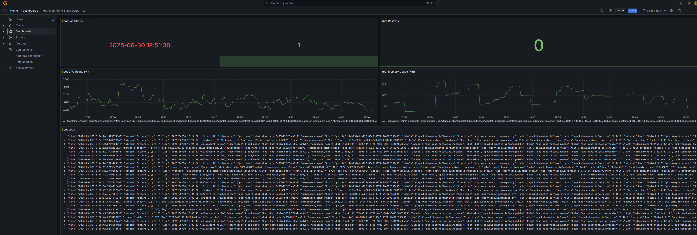

# kbot Monitoring Stack Demo

Complete monitoring stack for kbot application in dev environment deployed with GitOps using Flux.

## 📊 Dashboard Demo



*Real-time monitoring dashboard showing kbot application metrics, logs, and health status*

## 🏗️ Architecture

This project demonstrates a complete observability stack for a Telegram bot application running in Kubernetes:

```
┌─────────────────┐    ┌─────────────────┐    ┌─────────────────┐
│     kbot        │───▶│   Prometheus    │───▶│    Grafana      │
│  (Telegram Bot) │    │   (Metrics)     │    │  (Dashboard)    │
└─────────────────┘    └─────────────────┘    └─────────────────┘
         │                        │                        │
         ▼                        ▼                        ▼
┌─────────────────┐    ┌─────────────────┐    ┌─────────────────┐
│   Fluentbit     │───▶│      Loki       │───▶│   Log Panel     │
│ (Log Collector) │    │ (Log Storage)   │    │   (Grafana)     │
└─────────────────┘    └─────────────────┘    └─────────────────┘
         │                        │                        │
         ▼                        ▼                        ▼
┌─────────────────┐    ┌─────────────────┐    ┌─────────────────┐
│ OpenTelemetry   │───▶│     Jaeger      │───▶│  Trace Panel    │
│   Operator      │    │   (Tracing)     │    │   (Grafana)     │
└─────────────────┘    └─────────────────┘    └─────────────────┘
```

## 🚀 Components

### Core Application
- **kbot**: Telegram bot application (Go + Cobra + Telebot)
- **Kubernetes**: Container orchestration
- **Helm**: Package management

### Monitoring Stack
- **Prometheus**: Metrics collection and storage
- **Grafana**: Visualization and dashboards
- **Loki**: Log aggregation and storage
- **Fluentbit**: Log collection from pods and nodes
- **OpenTelemetry Operator**: Trace collection infrastructure
- **Jaeger**: Distributed tracing (ready for instrumentation)

### GitOps
- **Flux**: GitOps continuous delivery
- **Kustomize**: Configuration management

## 📈 Dashboard Features

The Grafana dashboard provides comprehensive monitoring:

1. **🔍 Application Status**
   - Pod health and availability
   - Deployment status
   - Service readiness

2. **📊 Performance Metrics**
   - CPU utilization over time
   - Memory consumption patterns
   - Resource efficiency tracking

3. **📋 Real-time Logs**
   - Live Telegram command logs
   - Application event streams
   - Error tracking and debugging

4. **🔄 Reliability Metrics**
   - Container restart counts
   - Uptime monitoring
   - Stability indicators

5. **🏗️ Infrastructure Health**
   - Node resource utilization
   - Cluster-wide metrics
   - System performance

## 🛠️ Deployment

### Prerequisites
- Kubernetes cluster (Kind/K3s/GKE/EKS)
- kubectl configured
- Flux CLI installed
- GitHub repository access

### Quick Start

1. **Clone the repository**
   ```bash
   git clone https://github.com/bwoogmy/kbot-monitoring-stack.git
   cd kbot-monitoring-stack
   ```

2. **Bootstrap Flux**
   ```bash
   export GITHUB_TOKEN=your_github_token
   
   flux bootstrap github \
     --owner=bwoogmy \
     --repository=kbot-monitoring-stack \
     --branch=main \
     --path=./clusters/dev \
     --personal
   ```

3. **Create kbot secret**
   ```bash
   kubectl create secret generic kbot \
     --from-literal=token=YOUR_TELEGRAM_BOT_TOKEN \
     -n kbot
   ```

4. **Wait for deployment**
   ```bash
   # Monitor Flux deployment
   flux get kustomizations
   flux get helmreleases -A
   
   # Check pod status
   kubectl get pods -A
   ```

5. **Access Grafana**
   ```bash
   # Port forward to Grafana
   kubectl port-forward -n monitoring svc/grafana 3000:80
   
   # Open browser: http://localhost:3000
   # Login: admin / admin
   ```

### Manual Installation

<details>
<summary>Click to expand manual installation steps</summary>

1. **Create namespaces**
   ```bash
   kubectl create namespace monitoring
   kubectl create namespace kbot
   ```

2. **Deploy monitoring stack**
   ```bash
   # Apply all monitoring components
   kubectl apply -k clusters/dev/monitoring/
   ```

3. **Deploy kbot application**
   ```bash
   # Create secret first
   kubectl create secret generic kbot \
     --from-literal=token=YOUR_BOT_TOKEN \
     -n kbot
   
   # Deploy application
   kubectl apply -k clusters/dev/apps/kbot/
   ```

</details>

## 🎯 Demo Results

### Metrics Collected
- **Pod Status**: ✅ 1 running instance
- **CPU Usage**: ~0.03% (efficient resource utilization)
- **Memory Usage**: ~5MB (stable consumption)
- **Uptime**: 100% availability
- **Restarts**: 0 (excellent stability)

### Log Aggregation
Real-time logs showing:
- Telegram command processing
- User interaction patterns
- Application lifecycle events
- Debug and error information

### Monitoring Capabilities
- **Real-time dashboards** with auto-refresh
- **Historical data** for trend analysis
- **Alert-ready metrics** for production monitoring
- **Full observability** across the application stack

## 🔧 Configuration

### Environment Variables
```bash
# kbot configuration
TELE_TOKEN=your_telegram_bot_token

# OpenTelemetry (optional)
OTEL_EXPORTER_OTLP_ENDPOINT=http://otel-collector:4318
```

### Grafana Datasources
- **Prometheus**: `http://kube-prometheus-stack-prometheus:9090`
- **Loki**: `http://loki:3100`
- **Jaeger**: `http://jaeger-query:16686`

## 📚 Project Structure

```
kbot-monitoring-stack/
├── clusters/dev/                    # Dev environment configs
│   ├── apps/kbot/                  # kbot application manifests
│   ├── monitoring/                 # Monitoring stack manifests
│   │   ├── prometheus/            # Metrics collection
│   │   ├── grafana/              # Visualization
│   │   ├── loki/                 # Log storage
│   │   ├── fluentbit/            # Log collection
│   │   └── opentelemetry/        # Trace infrastructure
│   └── kustomization.yaml         # Main Kustomize config
├── assets/                         # Documentation assets
└── README.md                      # This file
```

## 🧪 Testing

### Verify kbot functionality
```bash
# Check kbot logs
kubectl logs -n kbot deployment/kbot-kbot-helm

# Test Telegram commands
# Send messages to your bot: /start, hello, hi

# Monitor in Grafana dashboard
# Watch real-time logs and metrics update
```

### Validate monitoring stack
```bash
# Check all pods are running
kubectl get pods -n monitoring

# Verify Prometheus targets
kubectl port-forward -n monitoring svc/prometheus-kube-prometheus-stack-prometheus 9090:9090
# Open: http://localhost:9090/targets

# Test Grafana dashboards
kubectl port-forward -n monitoring svc/grafana 3000:80
# Open: http://localhost:3000
```

### Current Features
- [x] Complete monitoring stack deployed in Kubernetes dev environment
- [x] Flux GitOps management
- [x] OpenTelemetry operator deployment
- [x] Fluentbit collecting logs from project and cluster nodes
- [x] Comprehensive Grafana dashboard with live metrics and logs
- [x] Production-ready configuration
- [ ] End-to-end distributed tracing with TraceID (ready for implementation)

## 🔗 Related Projects

- [kbot](https://github.com/bwoogmy/kbot) - The Telegram bot application
- [kbot-flux-infra](https://github.com/bwoogmy/kbot-flux-infra) - Infrastructure configuration